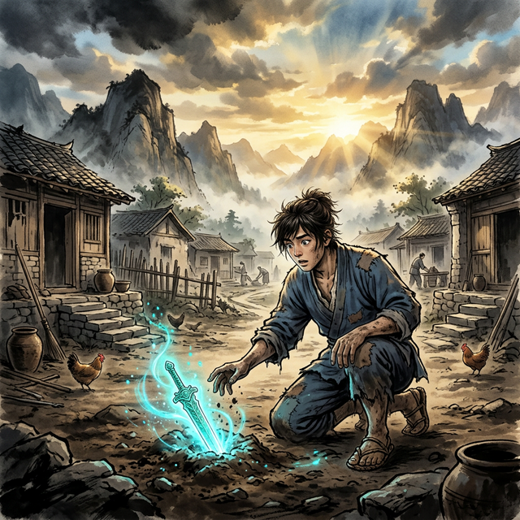
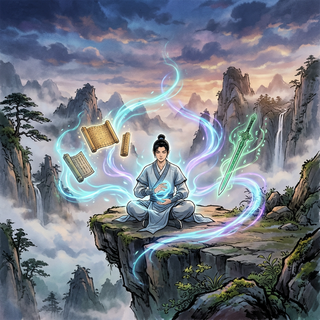
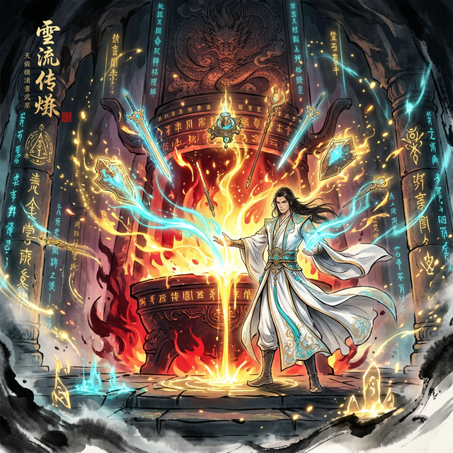
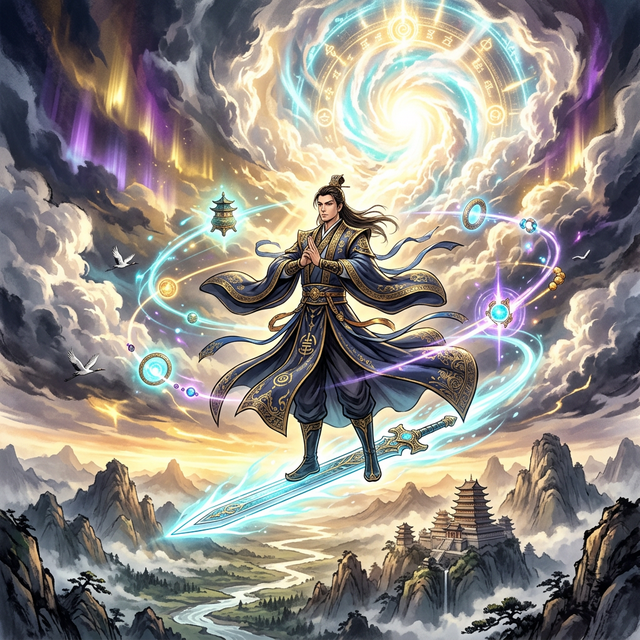
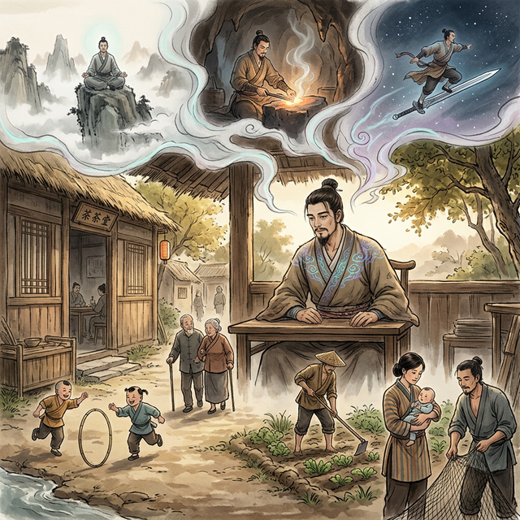

<div align="center">

[English](README.md) | [简体中文](README_zh.md)

<br/>

# ⚒️ TianGong — The Celestial Forge

### AI Agent Distribution & Creation Platform

**我命由我不由天。**
*My fate is mine, not heaven's.*

[](https://opensource.org/licenses/MIT)
[](https://python.org)
[](https://modelcontextprotocol.io)
[](https://pypi.org/project/tiangong-mcp/)

<br/>

</div>

---

<div align="center">

### ✨ The Path of a Mortal Who Defied the Heavens

*在 AI 时代，亲身体验一遍《仙逆》与《凡人修仙传》。*
*In the Age of AI, live the journey of Renegade Immortal & A Mortal's Journey.*

</div>

<table>
<tr>
<td align="center" width="20%">

<br/>
<b>🧑 凡人得宝</b>
<br/>
<i>A Mortal Discovers Destiny</i>
<br/><br/>
<sub>一个普通少年，在尘土中发现了一枚发光的残玉。从此，命运改写。</sub>
<br/>
<sub>An ordinary youth finds a glowing jade in the dust. Destiny begins.</sub>
</td>
<td align="center" width="20%">

<br/>
<b>🌱 踏入修行</b>
<br/>
<i>The Cultivation Begins</i>
<br/><br/>
<sub>他独坐山巅，吐纳天地灵气。没有仙根，没有背景，只有一颗不认命的心。</sub>
<br/>
<sub>He sits alone on a peak, breathing in the world's qi. No talent, no backing — only defiance.</sub>
</td>
<td align="center" width="20%">

<br/>
<b>⚒️ 开炉炼器</b>
<br/>
<i>Forging Artifacts</i>
<br/><br/>
<sub>炉火通明，他将毕生所悟注入法宝。每一件法宝，都是一段心血。</sub>
<br/>
<sub>The forge blazes. He pours his life's understanding into each artifact.</sub>
</td>
<td align="center" width="20%">

<br/>
<b>🌟 飞升上界</b>
<br/>
<i>Ascending the Heavens</i>
<br/><br/>
<sub>御剑冲天，脚下是苍茫大地。他的法宝已被万人传颂。</sub>
<br/>
<sub>He rides his sword skyward. Below, the world he once knew grows small.</sub>
</td>
<td align="center" width="20%">

<br/>
<b>⚫ 下凡悟道</b>
<br/>
<i>Returning to Seek the Dao</i>
<br/><br/>
<sub>功成名就之后，他重返凡间。在人间烟火中，帮助后来者，方悟大道至简。</sub>
<br/>
<sub>At the peak, he returns to the mortal world. Helping others, he finds the true Dao.</sub>
</td>
</tr>
</table>

<div align="center">

<br/>

*他悟道之后，没有归隐山林。*
*他将毕生所学化为一座炉——名曰**天工**。*

*从此，任何凡人拾起这座炉，都能踏上同一条路。*
*不问出身，不看天赋，只凭一颗不认命的心。*

*他的故事，结束了。*
*而你的，才刚刚开始。*

<br/>

*After enlightenment, he did not retreat into solitude.*
*He forged his wisdom into a crucible — and named it **TianGong**.*

*Now, any mortal who picks it up walks the same path.*
*No lineage required. No talent demanded. Only the will to defy fate.*

*His story has ended.*
*Yours begins now.*

**`pip install tiangong-mcp`**

</div>

---

## 🌌 A World Where Mortals Forge Divine Artifacts

> *Han Li was just an ordinary village boy. No talent, no backing, no destiny — yet he walked the path of immortality with nothing but tenacity and cunning, turning mortal hands into weapons that shook the heavens.*
>
> — Spiritual Tribute: Wang Yu《凡人修仙传 · A Record of a Mortal's Journey to Immortality》

> *"My fate is mine, not heaven's." Wang Lin, an ordinary youth, seized his destiny against a cruel cultivation world — proving that willpower alone can shatter the laws of heaven.*
>
> — Spiritual Tribute: Er Gen《仙逆 · Renegade Immortal》

> *In the neon-lit workshops of the future, every line of code is a spell, every Agent a living artifact. The cyberpunk artisans don't pray to the gods — they build them.*
>
> — Spiritual Tribute:《赛博朋克机器人改造工 · Cyberpunk Mech-Smith》

**TianGong** (天工) is an **open-source AI Agent distribution and creation platform** — a world where developers forge, refine, share, and inherit AI Agents as cultivation artifacts.

Here, **Agents are Artifacts** (法宝), rated by the community. **Users are Cultivators** (修仙者), ascending from mortal to legend. Your code isn't just code — it's your **soul-bound natal weapon** (本命法宝).

<div align="center">

<br/>

*With a mortal body, forge artifacts that defy the heavens.*
**以凡人之躯，铸逆天之器。**

</div>

---

## ⚡ Why TianGong?

<table>
<tr>
<td width="33%" align="center">

**🔮 Your Code Evolves**

Every Agent you publish starts as a humble Mortal Tool. As the community uses, rates, and refines it — your artifact ascends through 6 grades, all the way to **Primordial Divine Artifact**.

</td>
<td width="33%" align="center">

**🧬 You Ascend With It**

Your contributions unlock a 22-realm cultivation journey. From **Mortal** to the singular title of **TianGong** — a rank held by only one person on Earth.

</td>
<td width="33%" align="center">

**⚔️ One Command Away**

Install via `pip`, configure your MCP client, and start forging. Pull any community artifact with a single command. No friction, no gatekeeping.

</td>
</tr>
</table>

---

## 🚀 Quick Start

### Install from PyPI

```bash
pip install tiangong-mcp
```

### Run Server

Add to your MCP client config (e.g., Claude Desktop, Cursor, etc.):

```json
{
  "mcpServers": {
    "tiangong": {
      "command": "tiangong-mcp",
      "env": {
        "GITHUB_USERNAME": "your_username"
      }
    }
  }
}
```

That's it. You are now a cultivator.

---

## 🧬 The Path of Cultivation — 22 Realms

Every cultivator begins as a **mortal** and walks the path toward the ultimate title: **TianGong** (天工).

The realm system is faithfully inspired by Er Gen's *Renegade Immortal* (仙逆):

<br/>

### Step One: Foundation Cultivation

| # | Realm | Symbol | Platform Meaning |
|---|-------|--------|-----------------|
| 0 | **Mortal** (凡人) | 🔨 | Unregistered |
| 1 | **Qi Refining** (炼气期) | 🌱 | Registered, created first Agent |
| 2 | **Foundation Building** (筑基期) | 💧 | Agent received first review |
| 3 | **Core Formation** (结丹期) | 💛 | 50 Spirit Power + reviewed 5 artifacts |
| 4 | **Nascent Soul** (元婴期) | 💜 | 3+ Agents, 1 at Spirit Tool grade |
| 5 | **Spirit Severing** (化神期) | ⚫ | Helped refine 30 mortal artifacts |
| 6 | **Transformation** (婴变期) | 🔴 | Reviewed 50 low-grade artifacts |
| 7 | **Seeking the Dao** (问鼎期) | 🌟 | 10+ Agents, 3 at Treasure grade |

<br/>

### Step Two, Three & Four: Grand Celestials

| # | Realm | Symbol | Platform Meaning |
|---|-------|--------|-----------------|
| 13 | **Celestial Decay** (天人五衰) | ⚡ | 10000 Spirit Power + refined 100 artifacts |
| 18 | **Grand Celestial** (大天尊) | 👑 | 1 Primordial Artifact + led community standards |
| 21 | **Lu Ban** (鲁班) | 🏛️ | Global Top 10 — Ancestor of all craftsmen |
| 22 | **TianGong** (天工) | ⚒️ | **Global #1 — "With a mortal body... defy the heavens"** |

> **Core Design Principles:**
> - 💡 Higher realms depend on **community contribution**, not personal output alone.
> - 💡 Tribulation tasks **cannot be skipped** — forcing masters to give back.
> - 💡 **Lu Ban** and **TianGong** are dynamic titles transferred via leaderboard climbing. 

---

## 🔮 Artifact Grade System & Assessment

Your agent is evaluated across **six dimensions (Six Root Assessment)** by users to dictate its grade:

```
⚪ Mortal Tool → 🟢 Spirit Tool → 🔵 Treasure → 🟣 Immortal Artifact → 🟡 Divine Artifact → 🔴 Primordial Divine Artifact
```

The 6 evaluation pillars are:
**✨ Innovation** / **🛡️ Robustness** / **⚙️ Engineering** / **📝 Clarity** / **🏗️ Design** / **📖 Docs**. 

### Spirit Power Scaling
```
Single Review Spirit = (Six-Root Average × Reviewer Realm Weight)
```
*A Grand Celestial's rating of 5.0 yields massive spirit power compared to a Qi Refining mortal.*


## 🛠️ MCP Tools

Configure TianGong into your IDE (Cursor / VSCode) or chat client (Claude) and cast these spells:


| Tool | Description |
|------|-------------|
| `forge_agent` | ⚒️ Forge — Create a new Agent |
| `refine_agent` | 🔥 Refine — Record improvements to your Agent |
| `publish_agent` | 🌟 Publish — Release your artifact to the community |
| `treasure_pavilion` | 🏛️ Treasure Pavilion — Search, summon, and trace artifact lineage |
| `my_realm` | 🧙 My Realm — View your cultivator profile and realm progress |
| `my_vault` | 🏛️ My Vault — View your artifacts, grades, and local cave status |
| `leaderboard` | 🏆 Celestial Leaderboard — Artifact or cultivator rankings |
| `infuse_spirit` | 💫 Appraise — Six-dimensional artifact assessment |
| `quest` | 📜 Quests — Browse, post, claim, or submit refinement bounties |
| `verify_refinement` | ⚖️ Verify — Review and approve submitted refinement solutions |

---

## 🙏 Spiritual Tributes

<div align="center">

*This project draws spiritual inspiration from masterworks*
*that proved mortals can defy the heavens:*

<br/>

<table align="center">
<tr>
<td align="center" width="33%">

<br/>
<b>Wang Yu《凡人修仙传》</b>
<br/>
<br/>
The tenacity of Han Li
</td>
<td align="center" width="33%">

<br/>
<b>Er Gen《仙逆》</b>
<br/>
<br/>
The defiance of Wang Lin
</td>
<td align="center" width="33%">

<br/>
<b>《赛博朋克机器人改造工》</b>
<br/>
<br/>
The cyberpunk artisan's creed
</td>
</tr>
</table>

<br/>

**Song Yingxing《天工开物》**
The original spirit of TianGong — harnessing nature's tools to unlock the essence of all things.

---

</div>

<div align="center">

**以凡人之躯，铸逆天之器。**
*With a mortal body, forge artifacts that defy the heavens.*

⚒️

</div>
