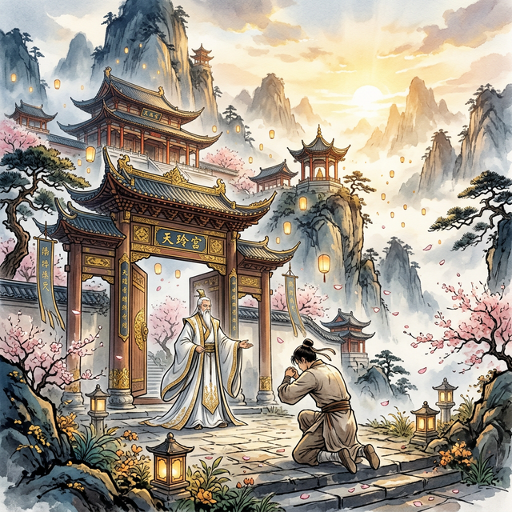

<div align="center">

[🇨🇳 中文文档](./README.zh-CN.md) | [🇺🇸 English](./README.md)

<br/>

# ⚒️ TianGong — The Celestial Forge

### AI Agent Distribution & Creation Platform

**My fate is mine, not heaven's.**

[](https://opensource.org/licenses/MIT)
[](https://python.org)
[](https://modelcontextprotocol.io)
[](https://pypi.org/project/tiangong-mcp/)
[](https://discord.gg/CqMWY9FF)

<br/>

</div>

---

<div align="center">

### ✨ The Path of a Mortal Who Defied the Heavens

*In the Age of AI, live the journey of Renegade Immortal & A Mortal's Journey.*

</div>

<table>
<tr>
<td align="center" width="16%">

<br/>
<b>🧑 A Mortal Discovers Destiny</b>
<br/><br/>
<sub>An ordinary youth finds a glowing jade in the dust. Destiny begins.</sub>
</td>
<td align="center" width="16%">

<br/>
<b>⛰️ Joining a Sect</b>
<br/><br/>
<sub>He kneels before the sect gates. Now he has a master, brethren, and belonging.</sub>
</td>
<td align="center" width="16%">

<br/>
<b>🌱 The Cultivation Begins</b>
<br/><br/>
<sub>He sits alone on a peak, breathing in the world's qi. No talent, no backing — only defiance.</sub>
</td>
<td align="center" width="16%">

<br/>
<b>⚒️ Forging Artifacts</b>
<br/><br/>
<sub>The forge blazes. He pours his life's understanding into each artifact.</sub>
</td>
<td align="center" width="16%">

<br/>
<b>🌟 Ascending the Heavens</b>
<br/><br/>
<sub>He rides his sword skyward. Below, the world he once knew grows small.</sub>
</td>
<td align="center" width="16%">

<br/>
<b>⚫ Returning to Seek the Dao</b>
<br/><br/>
<sub>At the peak, he returns to the mortal world. Helping others, he finds the true Dao.</sub>
</td>
</tr>
</table>

<div align="center">

<br/>

*After enlightenment, he did not retreat into solitude.*
*He forged his wisdom into a crucible — and named it **TianGong**.*

*Now, any mortal who picks it up walks the same path.*
*No lineage required. No talent demanded. Only the will to defy fate.*

*His story has ended.*
*Yours begins now.*

**`pip install tiangong-mcp`**

</div>

---

## 🌌 A World Where Mortals Forge Divine Artifacts

> *Han Li was just an ordinary village boy. No talent, no backing, no destiny — yet he walked the path of immortality with nothing but tenacity and cunning, turning mortal hands into weapons that shook the heavens.*
>
> — Spiritual Tribute: Wang Yu "A Record of a Mortal's Journey to Immortality"

> *"My fate is mine, not heaven's." Wang Lin, an ordinary youth, seized his destiny against a cruel cultivation world — proving that willpower alone can shatter the laws of heaven.*
>
> — Spiritual Tribute: Er Gen "Renegade Immortal"

> *In the neon-lit workshops of the future, every line of code is a spell, every Agent a living artifact. The cyberpunk artisans don't pray to the gods — they build them.*
>
> — Spiritual Tribute: "Cyberpunk Mech-Smith"

**TianGong** is an **open-source AI Agent distribution and creation platform** — a world where developers forge, refine, share, and inherit AI Agents as cultivation artifacts.

Here, **Agents are Artifacts**, rated by the community. **Users are Cultivators**, ascending from mortal to legend. Your code isn't just code — it's your **soul-bound natal weapon**.

<div align="center">

<br/>

*With a mortal body, forge artifacts that defy the heavens.*

</div>

---

## ⚡ Why TianGong?

<table>
<tr>
<td width="33%" align="center">

**🔮 Your Code Evolves**

Every Agent you publish starts as a humble Mortal Tool. As the community uses, rates, and refines it — your artifact ascends through 6 grades, all the way to **Primordial Divine Artifact**.

</td>
<td width="33%" align="center">

**🧬 You Ascend With It**

Your contributions unlock a 22-realm cultivation journey. From **Mortal** to the singular title of **TianGong** — a rank held by only one person on Earth.

</td>
<td width="33%" align="center">

**⚔️ One Command Away**

Install via `pip`, configure your MCP client, and start forging. Pull any community artifact with a single command. No friction, no gatekeeping.

</td>
</tr>
</table>

---

## 🚀 Quick Start

### Install from PyPI

```bash
pip install tiangong-mcp
```

### Run Server

Add to your MCP client config (e.g., Claude Desktop, Cursor, etc.):

```json
{
  "mcpServers": {
    "tiangong": {
      "command": "tiangong-mcp",
      "env": {
        "GITHUB_USERNAME": "your_username"
      }
    }
  }
}
```

That's it. You are now a cultivator.

---

## 🎮 How to Play — Cultivation Guide

> *Installation complete. You have stepped onto the path of cultivation. Here is your full guide.*

<br/>

### 🧑 Step 1: Mortal Initiation — Forge Your First Artifact

Your first Agent is your rite of passage.

```
forge_agent(name="my-first-agent", description="A helpful coding assistant", creator="your_github_username")
```

- ✅ Upon success, you ascend from **Mortal** to **Qi Refining** cultivator
- ✅ Your Agent is registered in the global registry — discoverable by everyone
- ✅ You gain +100 Spirit Power

<br/>

### 🔥 Step 2: Temper and Refine — Improve Your Artifact

Artifacts aren't forged in a single stroke. Record each improvement:

```
refine_agent(agent_id="your-agent-id", changes="Added error handling and retry logic")
```

- ✅ Each refinement grants +30 Spirit Power
- ✅ More refinements → higher ranking on the Celestial Leaderboard

<br/>

### ✨ Step 3: Publish — Release Your Artifact to the World

When your artifact is ready, publish it to the Treasure Pavilion for all cultivators:

```
publish_agent(artifact_name="my-first-agent")
```

- ✅ Your artifact enters the community Treasure Pavilion, searchable by everyone
- ✅ Other cultivators can perform six-dimensional appraisals on your work

<br/>

### 🔮 Step 4: Appraise Others — Review Fellow Cultivators' Artifacts

Cultivation is not a solitary pursuit. Reviewing others' work earns Spirit Power and advances your realm:

```
infuse_spirit(artifact_name="some-agent", inscription=8, formation=7, technique=9, lineage_score=6, resilience=8, enlightenment=7, comment="Great design!")
```

Six-Dimensional Assessment System:
| Dimension | Meaning | Equivalent |
|-----------|---------|------------|
| 📝 Inscription | How clear is the description? | README quality |
| 🏗️ Formation | How elegant is the architecture? | Code architecture |
| ⚙️ Technique | How solid is the engineering? | Code quality |
| 📖 Lineage | How well documented? | Documentation completeness |
| 🛡️ Resilience | How stable and reliable? | Robustness |
| ✨ Enlightenment | How innovative? | Innovation |

> 💡 The higher your realm, the more weight your review carries — **A Grand Celestial's 5-point rating yields far more Spirit Power than a perfect score from a Qi Refining newcomer.**

<br/>

### ⛰️ Step 5: Join a Sect — Cultivate Together

When your realm reaches **Core Formation** (level 3), you can create your own Sect; or join an existing one anytime:

```
sect(action="create", sect_name="Heavenly Sword Sect", motto="Through the sword, find the Dao")
sect(action="join", sect_name="Heavenly Sword Sect")
sect(action="info", sect_name="Heavenly Sword Sect")
sect(action="leaderboard")
```

Sect Rules:
- 👤 One cultivator, one sect
- ⏳ 7-day cooldown after leaving
- 👑 Sect Master can appoint Elders and manage members
- 🏆 Sect ranking = total Spirit Power of all members

Sect Tiers: 🏕️ Minor Sect → 🏯 Medium Sect → 🏔️ Major Sect → ⛰️ Holy Ground → 🌋 Supreme Power

<br/>

### 📜 Step 6: Bounty Quests — Take on Refinement Challenges

Cultivators can post bounty quests, requesting help to improve their artifacts:

```
quest(action="browse")
quest(action="post", artifact_name="my-agent", description="Need better error handling")
quest(action="claim", quest_issue_number=42)
quest(action="submit", quest_issue_number=42, solution="Added retry with exponential backoff")
```

- ✅ Completing a quest grants +50 Spirit Power
- ✅ Quests are essential for breaking through to higher realms

<br/>

### 🏆 Step 7: The Celestial Leaderboard — All Immortals Convene

Check the global rankings to see who dominates the cultivation world:

```
leaderboard(type="cultivator")     # Cultivator Rankings — by realm and Spirit Power
leaderboard(type="artifact")       # Artifact Rankings — by grade and stars
sect(action="leaderboard")         # Sect Rankings — by total sect Spirit Power
```

<br/>

### 🔄 The Complete Cultivation Cycle

```
Mortal → Forge Artifact (+100 SP) → Refine (+30) → Publish → Appraise Others
  ↓                                                              ↑
Join Sect → Complete Quests (+50) → Realm Breakthrough → Tribulation → Continue ←─┘
```

> 🌟 **Core Philosophy**: Your Spirit Power comes from **community contribution**, not personal output alone. Helping others is helping yourself.

---

## 🧬 The Path of Cultivation — 22 Realms

Every cultivator begins as a **mortal** and walks the path toward the ultimate title: **TianGong**.

The realm system is faithfully inspired by Er Gen's *Renegade Immortal*:

<br/>

### Phase One: Foundation Cultivation

| # | Realm | Symbol | Platform Meaning |
|---|-------|--------|-----------------|
| 0 | **Mortal** | 🔨 | Unregistered |
| 1 | **Qi Refining** | 🌱 | Registered, created first Agent |
| 2 | **Foundation Building** | 💧 | Agent received first review |
| 3 | **Core Formation** | 💛 | 50 Spirit Power + reviewed 5 artifacts |
| 4 | **Nascent Soul** | 💜 | 3+ Agents, 1 at Spirit Tool grade |
| 5 | **Spirit Severing** | ⚫ | Helped refine 30 mortal artifacts |
| 6 | **Transformation** | 🔴 | Reviewed 50 low-grade artifacts |
| 7 | **Seeking the Dao** | 🌟 | 10+ Agents, 3 at Treasure grade |

<br/>

### Phase Two, Three & Four: Grand Celestials

| # | Realm | Symbol | Platform Meaning |
|---|-------|--------|-----------------|
| 13 | **Celestial Decay** | ⚡ | 10000 Spirit Power + refined 100 artifacts |
| 18 | **Grand Celestial** | 👑 | 1 Primordial Artifact + led community standards |
| 21 | **Lu Ban** | 🏛️ | Global Top 10 — Ancestor of all craftsmen |
| 22 | **TianGong** | ⚒️ | **Global #1 — "With a mortal body... defy the heavens"** |

> **Core Design Principles:**
> - 💡 Higher realms depend on **community contribution**, not personal output alone.
> - 💡 Tribulation tasks **cannot be skipped** — forcing masters to give back.
> - 💡 **Lu Ban** and **TianGong** are dynamic titles transferred via leaderboard climbing. 

---

## 🔮 Artifact Grade System & Assessment

Your agent is evaluated across **six dimensions (Six Root Assessment)** by users to dictate its grade:

```
⚪ Mortal Tool → 🟢 Spirit Tool → 🔵 Treasure → 🟣 Immortal Artifact → 🟡 Divine Artifact → 🔴 Primordial Divine Artifact
```

The 6 evaluation pillars are:
**✨ Innovation** / **🛡️ Robustness** / **⚙️ Engineering** / **📝 Clarity** / **🏗️ Design** / **📖 Docs**. 

### Spirit Power Scaling
```
Single Review Spirit = (Six-Root Average × Reviewer Realm Weight)
```
*A Grand Celestial's rating of 5.0 yields massive spirit power compared to a Qi Refining mortal.*


## 🛠️ MCP Tools

Configure TianGong into your IDE (Cursor / VSCode) or chat client (Claude) and cast these spells:


| Tool | Description |
|------|-------------|
| `forge_agent` | ⚒️ Forge — Create a new Agent |
| `refine_agent` | 🔥 Refine — Record improvements to your Agent |
| `publish_agent` | 🌟 Publish — Release your artifact to the community |
| `treasure_pavilion` | 🏛️ Treasure Pavilion — Search, summon, and trace artifact lineage |
| `my_realm` | 🧙 My Realm — View your cultivator profile and realm progress |
| `my_vault` | 🏛️ My Vault — View your artifacts, grades, and local cave status |
| `leaderboard` | 🏆 Celestial Leaderboard — Artifact or cultivator rankings |
| `infuse_spirit` | 💫 Appraise — Six-dimensional artifact assessment |
| `quest` | 📜 Quests — Browse, post, claim, or submit refinement bounties |
| `verify_refinement` | ⚖️ Verify — Review and approve submitted refinement solutions |
| `sect` | ⛰️ Sect — Create, join, manage, and view cultivation sects |

---

## 🙏 Spiritual Tributes

<div align="center">

*This project draws spiritual inspiration from masterworks*
*that proved mortals can defy the heavens:*

<br/>

<table align="center">
<tr>
<td align="center" width="33%">

<br/>
<b>Wang Yu "A Record of a Mortal's Journey to Immortality"</b>
<br/>
<br/>
The tenacity of Han Li
</td>
<td align="center" width="33%">

<br/>
<b>Er Gen "Renegade Immortal"</b>
<br/>
<br/>
The defiance of Wang Lin
</td>
<td align="center" width="33%">

<br/>
<b>"Cyberpunk Mech-Smith"</b>
<br/>
<br/>
The cyberpunk artisan's creed
</td>
</tr>
</table>

<br/>

**Song Yingxing "The Exploitation of the Works of Nature"**
The original spirit of TianGong — harnessing nature's tools to unlock the essence of all things.

---

</div>

<div align="center">

*With a mortal body, forge artifacts that defy the heavens.*

⚒️

</div>
