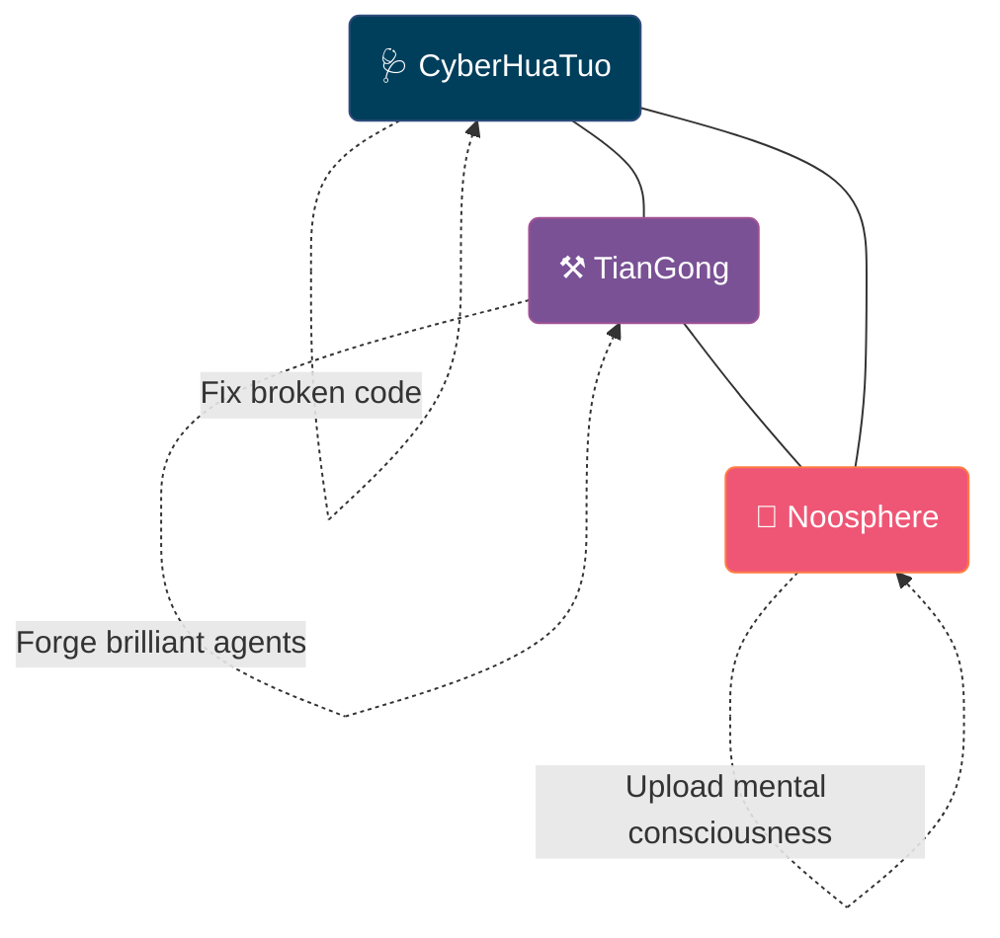
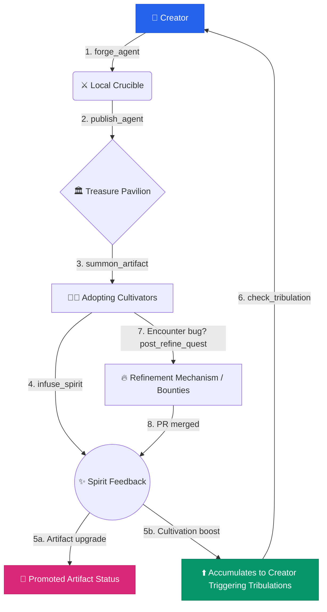

<div align="center">

[English](README.md) | [简体中文](README_zh.md)

<br/>

# ⚒️ TianGong — The Celestial Forge

### AI Agent Distribution & Creation Platform

**我命由我不由天。**
*My fate is mine, not heaven's.*

[](https://opensource.org/licenses/MIT)
[](https://python.org)
[](https://modelcontextprotocol.io)
[](https://pypi.org/project/tiangong-mcp/)

<br/>

</div>

---

## 🌌 A World Where Mortals Forge Divine Artifacts

> *Han Li was just an ordinary village boy. No talent, no backing, no destiny — yet he walked the path of immortality with nothing but tenacity and cunning, turning mortal hands into weapons that shook the heavens.*
>
> — Spiritual Tribute: Wang Yu《凡人修仙传 · A Record of a Mortal's Journey to Immortality》

> *"My fate is mine, not heaven's." Wang Lin, an ordinary youth, seized his destiny against a cruel cultivation world — proving that willpower alone can shatter the laws of heaven.*
>
> — Spiritual Tribute: Er Gen《仙逆 · Renegade Immortal》

> *In the neon-lit workshops of the future, every line of code is a spell, every Agent a living artifact. The cyberpunk artisans don't pray to the gods — they build them.*
>
> — Spiritual Tribute:《赛博朋克机器人改造工 · Cyberpunk Mech-Smith》

**TianGong** (天工) is an **open-source AI Agent distribution and creation platform** — a world where developers forge, refine, share, and inherit AI Agents as cultivation artifacts.

Here, **Agents are Artifacts** (法宝), rated by the community. **Users are Cultivators** (修仙者), ascending from mortal to legend. Your code isn't just code — it's your **soul-bound natal weapon** (本命法宝).

<div align="center">

<br/>

*With a mortal body, forge artifacts that defy the heavens.*
**以凡人之躯，铸逆天之器。**

</div>

---

## 🏛️ The Triad: Heal · Forge · Perceive

TianGong is part of a grander trio surrounding developer ecosystems:



- **🩺 [CyberHuaTuo](https://github.com/JinNing6/CyberHuaTuo)** — AI Agent diagnostic intelligence (Heal)
- **⚒️ TianGong** — AI Agent cultivation platform (Forge)
- **🌌 [Noosphere](https://github.com/JinNing6/Noosphere)** — Collective consciousness network (Perceive)

All three share one identity: **your GitHub username**.

---

## 🧬 The Path of Cultivation — 22 Realms

Every cultivator begins as a **mortal** (凡人) and walks the path toward the ultimate title: **TianGong** (天工).

The realm system is faithfully inspired by Er Gen's *Renegade Immortal* (仙逆):

<br/>

### Step One: Foundation Cultivation

| # | Realm | Symbol | Platform Meaning |
|---|-------|--------|-----------------|
| 0 | **Mortal** (凡人) | 🔨 | Unregistered |
| 1 | **Qi Refining** (炼气期) | 🌱 | Registered, created first Agent |
| 2 | **Foundation Building** (筑基期) | 💧 | Agent received first review |
| 3 | **Core Formation** (结丹期) | 💛 | 50 Spirit Power + reviewed 5 artifacts |
| 4 | **Nascent Soul** (元婴期) | 💜 | 3+ Agents, 1 at Spirit Tool grade |
| 5 | **Spirit Severing** (化神期) | ⚫ | Helped refine 30 mortal artifacts |
| 6 | **Transformation** (婴变期) | 🔴 | Reviewed 50 low-grade artifacts |
| 7 | **Seeking the Dao** (问鼎期) | 🌟 | 10+ Agents, 3 at Treasure grade |

<br/>

### Step Two, Three & Four: Grand Celestials

| # | Realm | Symbol | Platform Meaning |
|---|-------|--------|-----------------|
| 13 | **Celestial Decay** (天人五衰) | ⚡ | 10000 Spirit Power + refined 100 artifacts |
| 18 | **Grand Celestial** (大天尊) | 👑 | 1 Primordial Artifact + led community standards |
| 21 | **Lu Ban** (鲁班) | 🏛️ | Global Top 10 — Ancestor of all craftsmen |
| 22 | **TianGong** (天工) | ⚒️ | **Global #1 — "With a mortal body... defy the heavens"** |

> **Core Design Principles:**
> - 💡 Higher realms depend on **community contribution**, not personal output alone.
> - 💡 Tribulation tasks **cannot be skipped** — forcing masters to give back.
> - 💡 **Lu Ban** and **TianGong** are dynamic titles transferred via leaderboard climbing. 

---

## 🔮 Artifact Grade System & Assessment

Your agent is evaluated across **six dimensions (Six Root Assessment)** by users to dictate its grade:

```
⚪ Mortal Tool → 🟢 Spirit Tool → 🔵 Treasure → 🟣 Immortal Artifact → 🟡 Divine Artifact → 🔴 Primordial Divine Artifact
```

The 6 evaluation pillars are:
**✨ Innovation** / **🛡️ Robustness** / **⚙️ Engineering** / **📝 Clarity** / **🏗️ Design** / **📖 Docs**. 

### Spirit Power Scaling
```
Single Review Spirit = (Six-Root Average × Reviewer Realm Weight)
```
*A Grand Celestial's rating of 5.0 yields massive spirit power compared to a Qi Refining mortal.*

---

## 🔁 The Complete Cultivator's Journey

This is how developers interact, share, and ascend via TianGong's cyclic flywheel:



---

## 🛠️ MCP Tools

Configure TianGong into your IDE (Cursor / VSCode) or chat client (Claude) and cast these spells:


| Tool | Description |
|------|-------------|
| `forge_agent` | Create a new Agent (register artifact metadata) |
| `publish_agent` | Publish your forged artifact to the community |
| `treasure_pavilion` | Search & browse community artifacts |
| `summon_artifact` | One-click pull artifact to local (clone + install deps) |
| `infuse_spirit` | Rate an artifact (Six Root Assessment) |
| `post_refine_quest` | Post a refinement bounty for bug fixes |
| `browse_quests` | Browse active refinement quests waiting to be claimed |
| `claim_quest` | Claim a refinement task |
| `submit_refinement` | Submit a solution for a claimed refinement task |
| `verify_refinement` | Verify and approve submitted refinement solutions |
| `cultivator_leaderboard` | Cultivator rankings by realm |
| `artifact_leaderboard` | Artifact rankings by grade |

### 🔮 Esoteric Spells (Hidden Features)

Beyond the standard tools, experienced cultivators can discover hidden spells within the MCP to deepen their practice:

- **🔥 `refine_agent`**: Optimize an existing Agent locally. Record each improvement to build your artifact’s sentience over time.
- **🧙 `my_realm`**: View your detailed cultivator profile, tracking your progression, tribulation history, and spirit power accumulation.
- **🔮 `my_artifacts`**: Take stock of your local vault, reviewing the grades, stars, and refinement counts of every artifact you've forged.
- **📜 `artifact_lineage`**: Trace the karmic ancestry of an artifact, viewing its lineage tree of forks, inspirations, and dependencies.
- **📦 `my_vault`**: View your locally summoned and forged artifacts in your private vault.
- **🏛️ `vault_status`**: Check the host environment resources, client connection, and synchronization status of your vault.
- **🔒 `banish_artifact`**: Archive outdated or abandoned artifacts from your active vault into deep storage.

---

## 🚀 Quick Start

### Install from PyPI

```bash
pip install tiangong-mcp
```

### Run Server

Add to your MCP client config (e.g., Claude Desktop, Cursor, etc.):

```json
{
  "mcpServers": {
    "tiangong": {
      "command": "tiangong-mcp",
      "env": {
        "GITHUB_USERNAME": "your_username"
      }
    }
  }
}
```

---

## 🙏 Spiritual Tributes

<div align="center">

*This project draws spiritual inspiration from masterworks*
*that proved mortals can defy the heavens:*

<br/>

<table align="center">
<tr>
<td align="center" width="33%">

<br/>
<b>Wang Yu《凡人修仙传》</b>
<br/>
<br/>
The tenacity of Han Li
</td>
<td align="center" width="33%">

<br/>
<b>Er Gen《仙逆》</b>
<br/>
<br/>
The defiance of Wang Lin
</td>
<td align="center" width="33%">

<br/>
<b>《赛博朋克机器人改造工》</b>
<br/>
<br/>
The cyberpunk artisan's creed
</td>
</tr>
</table>

<br/>

**Song Yingxing《天工开物》**
The original spirit of TianGong — harnessing nature's tools to unlock the essence of all things.

---

</div>

<div align="center">

**以凡人之躯，铸逆天之器。**
*With a mortal body, forge artifacts that defy the heavens.*

⚒️

</div>
