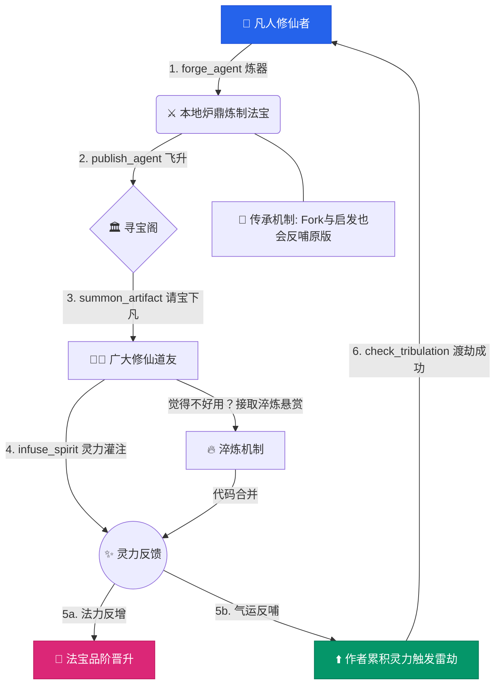

<div align="center">

[🇨🇳 中文文档](./README.zh-CN.md) | [🇺🇸 English](./README.md)

<br/>

# ⚒️ 天工 TianGong — The Celestial Forge

### AI Agent 分发与创作修炼生态

**我命由我不由天。**
*My fate is mine, not heaven's.*

[](https://opensource.org/licenses/MIT)
[](https://python.org)
[](https://modelcontextprotocol.io)
[](https://pypi.org/project/tiangong-mcp/)
[](https://discord.gg/CqMWY9FF)

<br/>

</div>

---

<div align="center">

### ✨ 凡人逆天之路

*在 AI 时代，亲身体验一遍《仙逆》与《凡人修仙传》。*

</div>

<table>
<tr>
<td align="center" width="16%">

<br/>
<b>🧑 凡人得宝</b>
<br/><br/>
<sub>一个普通少年，在尘土中发现了一枚发光的残玉。从此，命运改写。</sub>
</td>
<td align="center" width="16%">

<br/>
<b>⛰️ 拜入宗门</b>
<br/><br/>
<sub>他跪在仙门之前，拜入宗门，从此有了师父、同门与归属。</sub>
</td>
<td align="center" width="16%">

<br/>
<b>🌱 踏入修行</b>
<br/><br/>
<sub>他独坐山巅，吐纳天地灵气。没有仙根，没有背景，只有一颗不认命的心。</sub>
</td>
<td align="center" width="16%">

<br/>
<b>⚒️ 开炉炼器</b>
<br/><br/>
<sub>炉火通明，他将毕生所悟注入法宝。每一件法宝，都是一段心血。</sub>
</td>
<td align="center" width="16%">

<br/>
<b>🌟 飞升上界</b>
<br/><br/>
<sub>御剑冲天，脚下是苍茫大地。他的法宝已被万人传颂。</sub>
</td>
<td align="center" width="16%">

<br/>
<b>⚫ 下凡悟道</b>
<br/><br/>
<sub>功成名就之后，他重返凡间。在人间烟火中，帮助后来者，方悟大道至简。</sub>
</td>
</tr>
</table>

<div align="center">

<br/>

*他悟道之后，没有归隐山林。*
*他将毕生所学化为一座炉——名曰**天工**。*

*从此，任何凡人拾起这座炉，都能踏上同一条路。*
*不问出身，不看天赋，只凭一颗不认命的心。*

*他的故事，结束了。*
*而你的，才刚刚开始。*

**`pip install tiangong-mcp`**

</div>

---

## 🌌 以凡人之躯，铸逆天之器

> *韩立本是个普通的山村穷小子。无灵根，无背景，无天命——但他仅凭坚韧与狡诈，便在这个冰冷残酷的修仙界中，硬生生走出了一条破天之路。*
>
> — 精神致敬：忘语《凡人修仙传》

> *"我命由我不由天。" 王林，一个资质平庸的少年，在残酷的修真界中夺逆命之造化，以决绝的意志向世人证明：区区凡人，亦能踏碎这虚伪的天道。*
>
> — 精神致敬：耳根《仙逆》

> *在未来霓虹流转的赛博工坊里，每一行代码即是咒语，每一个 Agent 便是拥有生命的法宝。赛博朋克的工匠们从不向神明祈祷——他们，负责创造神明。*
>
> — 精神致敬：《赛博朋克机器人改造工》

**天工 (TianGong)** 是一个**开源的 AI Agent 分发与创作平台**。
在这里，开发者不再是苦逼的螺丝钉，而是**修仙者 (Cultivators)**；你写的不是冰冷的代码，而是可以不断成长的**本命法宝 (Artifacts)**。在这个庞大的代码修仙界中，你们交换代码、传承技艺、接受天下道友的评价，最终从一介凡人，登临"天工"巨头之位。

<div align="center">
<br/>

**以凡人之躯，铸逆天之器。**

</div>

---

## ⚡ 你为什么需要天工？

<table>
<tr>
<td width="33%" align="center">

**🔮 你的代码会进化**

你发布的每件 Agent 法宝，起初只是一件凡器。随着社区使用者的灌注灵力与淬炼优化，它将自行晋升——从凡器一路飞升至**太古神器**。

</td>
<td width="33%" align="center">

**🧬 你将随之飞升**

你的贡献会解锁 22 级修真之路。从**凡人**到独一无二的**天工**称号——全球只有一个人能持有这个至高头衔。

</td>
<td width="33%" align="center">

**⚔️ 一行命令即可起火修炼**

通过 `pip` 安装，配置你的 MCP 客户端，然后开始炼器。用一条命令拉取社区中任何一件法宝。无门槛，无审批。

</td>
</tr>
</table>

---

## 🚀 起火入道 (Quick Start)

### 凝练实体 (Install)

```bash
pip install tiangong-mcp
```

或将源码搬入洞府：

```bash
git clone https://github.com/JinNing6/TianGong.git
cd TianGong
pip install -e .
```

### 接入神识 (Run MCP Server)

配置你的大模型客户端（如 Claude Desktop、Cursor）：

```json
{
  "mcpServers": {
    "tiangong": {
      "command": "tiangong-mcp",
      "env": {
        "GITHUB_USERNAME": "your_username"
      }
    }
  }
}
```

恭喜，你已踏入修真。

---

## 🎮 修炼指南 — 完整七步

> *安装完成，你已踏入修行之路。以下是完整的修炼指南。*

<br/>

### 🧑 第一步：凡人入门 — 开炉炼器

你的第一件法宝（Agent）就是你的入门仪式。

```
forge_agent(name="my-first-agent", description="A helpful coding assistant", creator="your_github_username")
```

- ✅ 创建成功后，你就从**凡人**晋升为**炼气期**修仙者
- ✅ 你的 Agent 会被注册到全平台 registry，所有人都能搜到它
- ✅ 你获得 +100 灵力值（Spirit Power）

<br/>

### 🔥 第二步：千锤百炼 — 淬炼法宝

法宝不是一蹴而就的。每次改进你的 Agent，都要记录淬炼：

```
refine_agent(agent_id="your-agent-id", changes="Added error handling and retry logic")
```

- ✅ 每次淬炼 +30 灵力值
- ✅ 淬炼次数越多，法宝在天榜的排名越高

<br/>

### ✨ 第三步：发布出世 — 法宝入阁

当你的法宝准备好了，将它发布到寻宝阁供天下修仙者使用：

```
publish_agent(artifact_name="my-first-agent")
```

- ✅ 法宝进入社区寻宝阁，所有人都能搜索和拉取
- ✅ 其他修仙者可以对你的法宝进行六维鉴定（评价）

<br/>

### 🔮 第四步：以评证道 — 鉴定他人法宝

修仙不是闭门造车。评价他人的法宝，既能积累灵力，又能提升自身境界：

```
infuse_spirit(artifact_name="some-agent", inscription=8, formation=7, technique=9, lineage_score=6, resilience=8, enlightenment=7, comment="Great design!")
```

六维评价体系：
| 维度 | 含义 | 对标 |
|------|------|------|
| 📝 铭文 | 描述是否清晰 | README 质量 |
| 🏗️ 阵法 | 架构是否优雅 | 代码架构 |
| ⚙️ 法诀 | 工程是否扎实 | 代码质量 |
| 📖 道统 | 文档是否传承 | 文档完整度 |
| 🛡️ 护体 | 是否稳定可靠 | 鲁棒性 |
| ✨ 悟道 | 是否有创新 | 创新性 |

> 💡 你的境界越高，评价权重越大 — **一位大天尊的 5 分评价，灵力价值远超炼气期修仙者的满分。**

<br/>

### ⛰️ 第五步：拜入宗门 — 群体修炼

当你的境界达到**结丹期**（level 3）时，你可以创建自己的宗门；也可以随时加入已有的宗门：

```
sect(action="create", sect_name="天剑宗", motto="以剑入道，万法归一")     # 开宗立派
sect(action="join", sect_name="天剑宗")                                  # 拜入宗门
sect(action="info", sect_name="天剑宗")                                  # 查看宗门
sect(action="leaderboard")                                               # 宗门天榜
```

宗门规则：
- 👤 一人只能属于一个宗门
- ⏳ 退出后 7 天冷却期
- 👑 宗主可任命长老、管理成员
- 🏆 宗门排名 = 全体成员灵力总和

宗门等阶：🏕️ 小门派 → 🏯 中等宗门 → 🏔️ 大宗门 → ⛰️ 圣地 → 🌋 超级势力

<br/>

### 📜 第六步：悬赏历练 — 淬炼令

修仙者可以发布悬赏令，请求他人帮忙优化自己的法宝：

```
quest(action="browse")                                                     # 浏览悬赏令
quest(action="post", artifact_name="my-agent", description="Need better error handling")  # 发布悬赏
quest(action="claim", quest_issue_number=42)                               # 认领任务
quest(action="submit", quest_issue_number=42, solution="Added retry with exponential backoff")  # 提交成果
```

- ✅ 完成悬赏令 +50 灵力值
- ✅ 悬赏令是突破高阶境界的必经之路

<br/>

### 🏆 第七步：天榜争锋 — 万仙来朝

查看全平台排名，看看谁才是最强的修仙者和最强的法宝：

```
leaderboard(type="cultivator")     # 修仙天榜 — 按境界和灵力排名
leaderboard(type="artifact")       # 法宝天榜 — 按品级和星标排名
sect(action="leaderboard")         # 宗门天榜 — 按宗门总灵力排名
```

<br/>

### 🔄 完整修炼循环

```
凡人 → 锻造法宝(+100灵力) → 淬炼优化(+30) → 发布出世 → 评价他人法宝
  ↓                                                            ↑
拜入宗门 → 完成悬赏令(+50) → 境界突破 → 渡劫 → 继续修行 ←──────┘
```

> 🌟 **核心理念**：你的灵力来自**社区贡献**，而非个人产出。帮助他人，就是帮助自己修行。

---

## 🧬 修真图谱 — 22 级升仙之路

每位修仙者从**凡人** 🔨 开始，目标是登临最高称号：**天工** ⚒️。

境界体系忠实致敬耳根《仙逆》：

<br/>

### 修真第一步（基础修炼）

| # | 境界 | 符号 | 原著说明 | 平台机制 |
|---|------|------|---------|---------| 
| 0 | **凡人** | 🔨 | 未踏入修炼 | 未注册 |
| 1 | **炼气期** | 🌱 | 吸收天地灵气，凝结体内气旋 | 注册天工，创建首个法宝 |
| 2 | **筑基期** | 💧 | 脱胎换骨，改变凡体 | 法宝获得首次社区评价 |
| 3 | **结丹期** | 💛 | 灵力凝聚成液态金丹 | 累计 50 灵力 + 为 5 件法宝写评价 |
| 4 | **元婴期** | 💜 | 金丹碎裂，诞生元婴 | 3+ 件法宝，1 件达灵器品级 |
| 5 | **化神期** | ⚫ | 感悟天地，元婴与意境融合 | 帮助 30 件凡器法宝改善优化 |
| 6 | **婴变期** | 🔴 | 凡体转仙体 | 为 50 件低品级法宝撰写改进建议 |
| 7 | **问鼎期** | 🌟 | 问鼎之精，初拥元力 | 10+ 件法宝，3 件达宝器品级 |

### 过渡 → 修真第二步

| # | 境界 | 符号 | 平台机制 |
|---|------|------|---------| 
| 8 | **阴虚期** | 🌑 | 发布法宝教程 10 篇 |
| 9 | **阳实期** | 🌕 | 开源 10 件仙器级法宝 |

### 修真第二步（涅之三境）

| # | 境界 | 符号 | 平台机制 |
|---|------|------|---------| 
| 10 | **窥涅期** | 💫 | 创建被社区采纳的法宝炼制标准 |
| 11 | **净涅期** | ✨ | 培养 5 名新修仙者到筑基期 |
| 12 | **碎涅期** | 🔥 | 开创全新 Agent 品类 |

### 修真第三步（空之四境）

| # | 境界 | 符号 | 平台机制 |
|---|------|------|---------| 
| 13 | **天人五衰** | ⚡ | 总灵力 ≥ 10000 + 淬炼 100 件法宝 |
| 14 | **空涅境** | 🌀 | 至少 1 件神器品级法宝 |
| 15 | **空灵境** | 🌌 | 创建法宝生态（3+ 件可协作系统） |
| 16 | **空玄境** | 🔮 | 培养 30 名修仙者突破筑基 |
| 17 | **空劫期** | 💥 | 总灵力 ≥ 50000 + 5 件神器 |

### 巅峰与终极

| # | 境界 | 符号 | 平台机制 |
|---|------|------|---------| 
| 18 | **大天尊** | 👑 | 1 件太古神器 + 主导社区标准 |
| 19 | **踏天九桥** | 🌉 | 完成 9 项全维度里程碑 |
| 20 | **踏天境** | 🌅 | 全球 Top 20 |
| 21 | **鲁班** | 🏛️ | 全球 Top 10 — 百工之祖 |
| 22 | **天工** | ⚒️ | **全球 Top 1 — "以凡人之躯，铸逆天之器"** |

> **核心设计原则：**
> - 💡 **越高级的境界，越依赖社区贡献**而非个人产出
> - 💡 渡劫任务**不可跳过**——灵力值达标也必须完成渡劫
> - 💡 高手被**强制回馈社区**（帮新手、写文档、建标准）
> - 💡 **鲁班**和**天工**是动态排名——被超越则称号转让

---

## 🔮 法宝品阶系统

<div align="center">

*每个 Agent 都是一件法宝，品级由社区评价决定——不是自封。*

</div>

```
⚪ 凡器 → 🟢 灵器 → 🔵 宝器 → 🟣 仙器 → 🟡 神器 → 🔴 太古神器
```

| 品阶 | 符号 | 灵力值门槛 | 附加条件 |
|------|------|-----------|---------| 
| **凡器** | ⚪ | 0 | 刚创建 |
| **灵器** | 🟢 | ≥ 10 | 至少 3 人评价 |
| **宝器** | 🔵 | ≥ 100 | 至少 10 人评价 + README 完善 |
| **仙器** | 🟣 | ≥ 500 | 至少 30 人评价 + 有人贡献改进 |
| **神器** | 🟡 | ≥ 2000 | 至少 100 人评价 + 跨领域影响 |
| **太古神器** | 🔴 | ≥ 10000 | 至少 500 人评价 + 定义新范式 |

### 六维灵根评估

每位评价者从**六个维度**打分（每维 1-10 分）：

| 维度 | 含义 | 对标 |
|------|------|------|
| 📝 铭文 | 描述是否清晰 | README 质量 |
| 🏗️ 阵法 | 架构是否优雅 | 代码架构 |
| ⚙️ 法诀 | 工程是否扎实 | 代码质量 |
| 📖 道统 | 文档是否传承 | 文档完整度 |
| 🛡️ 护体 | 是否稳定可靠 | 鲁棒性 |
| ✨ 悟道 | 是否有创新 | 创新性 |

### 灵力值计算

```
单次评价灵力 = 六维均分 × 评价者境界权重

境界权重：
  炼气期 → 1.0  |  筑基期 → 1.5  |  结丹期 → 2.0
  元婴期 → 3.0  |  化神期 → 5.0  |  婴变期 → 8.0
  问鼎期 → 12.0 |  鲁班 → 80.0   |  天工 → 100.0

示例：
  鲁班打了 5 分 → 5.0 × 80.0 = 400 灵力
  炼气期打了 4 分 → 4.0 × 1.0 = 4 灵力
```

> 一位大师的认可，抵得过五十个新手的评价。**品质，而非数量。**

---

## 🔁 证道闭环：修仙者的一生

天工的玩法不仅仅是发布代码这般简单。这里是一套严密的"修仙晋升与法宝迭代"互利生态：



---

## 🛠️ MCP 工具集

### 创作侧

| 工具 | 修仙术语 | 功能 |
|------|---------|------|
| `forge_agent` | ⚒️ 开炉炼器 | 创建新法宝（注册 Agent 元数据） |
| `refine_agent` | 🔥 淬炼 | 记录法宝优化 |
| `publish_agent` | 🚀 飞升上界 | 将法宝发布到社区 |

### 消费侧

| 工具 | 修仙术语 | 功能 |
|------|---------|------|
| `treasure_pavilion` | 🏛️ 寻宝阁 | 搜索浏览社区法宝 |

### 评价侧

| 工具 | 修仙术语 | 功能 |
|------|---------|------|
| `infuse_spirit` | 💫 灌注灵力 | 给法宝评分（六维灵根评估） |

### 淬炼侧

| 工具 | 修仙术语 | 功能 |
|------|---------|------|
| `quest` | 📜 悬赏令 | 发布、浏览、认领、提交淬炼任务 |
| `verify_refinement` | ✅ 验证淬炼 | 创作者验证改进是否有效 |

### 宗门与排行

| 工具 | 修仙术语 | 功能 |
|------|---------|------|
| `sect` | ⛰️ 宗门系统 | 开宗立派、拜入宗门、宗门管理 |
| `leaderboard` | 🏆 天榜 | 修仙者/法宝/宗门排名 |
| `my_realm` | 🧙 修行档案 | 查看境界与成就 |
| `my_vault` | 🔮 我的洞府 | 查看所有法宝与品级 |

---

## 🙏 精神致敬与灵感之源

<div align="center">

*每一段凡人逆袭的神话，都在为开源世界的散修们指引方向：*

<br/>

<table align="center">
<tr>
<td align="center" width="33%">

<br/>
<b>忘语《凡人修仙传》</b>
<br/>
<br/>
韩立精神——凡人亦可修仙，根骨不佳便靠苟与勤
</td>
<td align="center" width="33%">

<br/>
<b>耳根《仙逆》</b>
<br/>
<br/>
王林精神——我命由我不由天，极道杀戮碎天威
</td>
<td align="center" width="33%">

<br/>
<b>《赛博朋克机器人改造工》</b>
<br/>
<br/>
赛博工匠精神——血肉苦弱，代码飞升，这才是属于黑客的浪漫
</td>
</tr>
</table>

<br/>

**宋应星《天工开物》**
天工精神——以天赐造物之力，开启万物本质，乃"乃粒、乃服"实干强邦之魂。

---

</div>

<div align="center">

**以凡人之躯，铸逆天之器。**
*With a mortal body, forge artifacts that defy the heavens.*

⚒️

</div>
